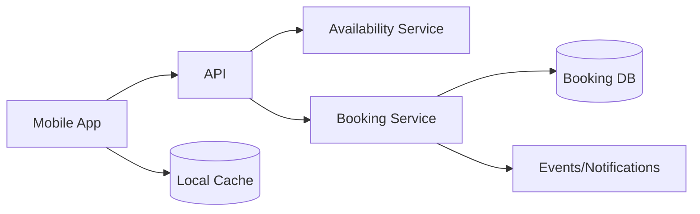

# Mobile System Design Framework

Use this framework for architecture reviews and interviews.

## 1. Clarify requirements
Users, critical flows, platforms, offline expectations, security/privacy, latency, availability and business-critical operations.

## 2. Define assumptions
State scale assumptions explicitly. Do not pretend invented numbers are known facts.

## 3. Client architecture
Presentation/state, domain/use cases, repository/data sources, platform services, observability.

## 4. API/data contracts
Authentication, pagination, idempotency, compatibility/versioning, errors and correlation IDs.

## 5. Offline/data consistency
Source of truth, cache freshness, writes, sync, conflicts and migration.

## 6. Reliability
Timeout, retry/backoff, cancellation, duplicate operations, degraded mode and feature flags.

## 7. Security
Sensitive-data minimization, secure storage, transport, authorization and privacy.

## 8. Operations
Crash/ANR, performance, API telemetry, release cohorts and rollback/mitigation.

# Worked design: Appointment Booking

## Requirements
Browse availability, select service/provider/time, book, view booking, cancel/reschedule. Assume mobile clients can temporarily lose connectivity.

## Key design choice
Availability is time-sensitive; cached slots can improve browsing but booking confirmation must be validated server-side.

## Booking flow
1. Client requests availability.
2. User chooses a slot.
3. Client submits booking with operation/idempotency identity.
4. Server revalidates availability and commits atomically according to backend design.
5. Client treats server confirmation as authoritative.
6. Timeout/ambiguous response triggers status reconciliation, not blind duplicate booking.

## 10K → 10M discussion
Do not jump straight to microservices. Revisit measured bottlenecks: read traffic/caching, hot partitions, booking contention, notification fan-out, observability, regional requirements and operational ownership. Architecture evolves from constraints and evidence.
