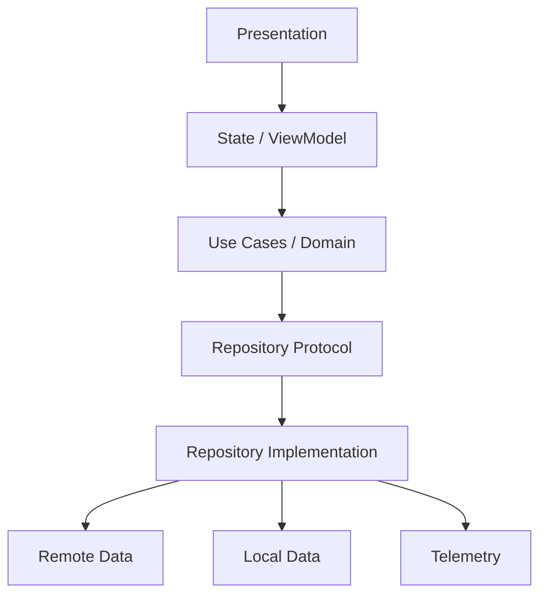

# Mobile Architecture — Deep Track

Architecture is the set of decisions that makes a mobile product **safe and economical to change**.

## Patterns
### MVC
Simple separation, familiar in legacy applications. Risk: controllers can accumulate responsibilities.

### MVVM
Moves presentation behavior/state into a ViewModel-like boundary. Useful for testability and state-driven UI, but a huge ViewModel is simply a new “massive controller.”

### MVI / unidirectional state
Intent/event → reducer/logic → new state → UI. Strong predictability can help complex state, at the cost of additional structure.

### Clean Architecture
Dependency direction protects domain rules from frameworks/data sources. Valuable for complex domains and long-lived products; excessive layers in small apps can slow navigation and delivery.

## Decision matrix
| Situation | Likely concern |
|---|---|
| Small, short-lived feature | avoid unnecessary layers |
| Complex state-heavy UI | explicit state flow/MVVM/MVI can help |
| Multiple data sources/offline | repository/source-of-truth boundaries matter |
| Large multi-team app | modular ownership/build boundaries matter |
| Legacy app | incremental seams usually beat wholesale rewrite |

## Reference model

Dependency direction and ownership are more important than folder names.

## Deep topics
- [Offline, Sync & Caching](Offline-Sync-Caching.md)
- [Modularization & DI](Modularization-DI.md)
- [Architecture Review Checklist](CHECKLIST.md)
- [Architecture Q&A](QUESTIONS-ANSWERS.md)
