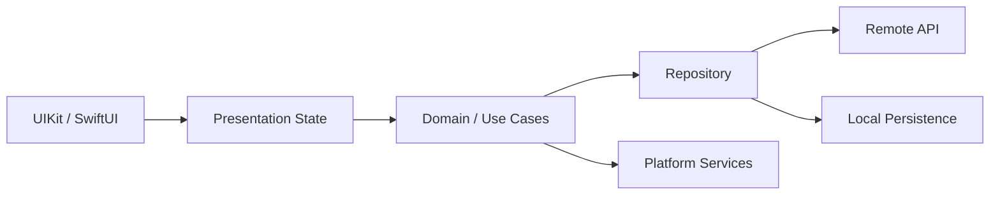

# iOS Engineering — Deep Track

**Goal:** refresh and deepen senior iOS engineering knowledge from language/runtime fundamentals through architecture, debugging, testing and release decisions.

## Learning map
1. [Swift & Objective-C](Swift-ObjectiveC.md)
2. [UIKit & SwiftUI](UIKit-SwiftUI.md)
3. [Concurrency](Concurrency.md)
4. [Networking & Data](Networking-Data.md)
5. [Architecture](../Mobile-Architecture/README.md)
6. [Testing, Debugging & Performance](Testing-Debugging.md)
7. [Security & Release](Security-Release.md)
8. [Modernization Playbook](Modernization-Playbook.md)
9. [Interview Q&A](QUESTIONS-ANSWERS.md)

## Mental model
A production iOS app is more than screens. Think in layers: **UI/state → domain/use cases → repositories → remote/local data → platform services**, with explicit boundaries for concurrency, failure handling, observability and testability.

The diagram is a reasoning model, not a mandatory architecture. Smaller apps may need fewer layers.

## Senior-level questions to keep asking
- Who owns this state and what is its lifecycle?
- Which work can block the main actor/thread?
- What happens offline, during retry, or after token expiry?
- Is cancellation propagated correctly?
- Can this dependency be tested independently?
- What happens during an app upgrade or data migration?
- What telemetry proves the feature is healthy after release?

> Version-sensitive APIs should be checked against current Apple documentation before production use.
