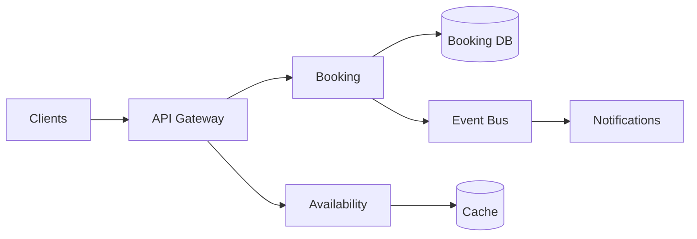

# Design an Appointment Booking Platform

## Requirements
Search services/providers, view availability, book, reschedule/cancel, notify users. Assume multi-location businesses and mobile/web clients.

## Critical invariant
Two users should not successfully own the same exclusive slot.

## Design
Availability reads may use cached/derived views, but booking confirmation revalidates against authoritative state. Use transaction/concurrency control appropriate to the data store. A stable idempotency/operation key protects retries.

## Failure
If client times out after submit, query booking status by operation identity rather than blindly creating another booking.

## Scale evolution
Measure hot providers/locations, read load and contention. Add caching/partitioning/asynchronous notification based on bottlenecks rather than prematurely splitting every component.
