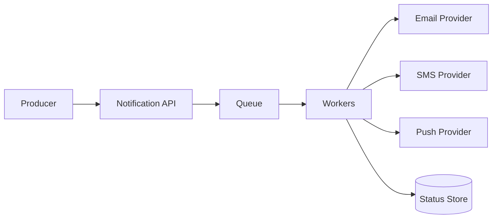

# Design a Notification Platform

## Requirements
Send transactional email/SMS/push, support templates/preferences, retries and delivery tracking.

## Design
Validate request, assign notification identity, enqueue, route to channel worker and record attempt/status.

## Reliability
Retry transient failures with backoff; distinguish permanent failures. Consumers should tolerate duplicate delivery from infrastructure. User-facing channels may still deliver duplicates despite system safeguards, so product semantics matter.

## Scale
Partition queues/workers by channel/tenant/priority where evidence requires it. Protect providers with rate limits.
