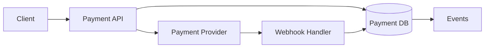

# Design Payment Processing

## Requirements
Create payment intent/order, confirm payment, expose status, refund where allowed, reconcile provider callbacks.

## Invariants
Do not double-charge a single intended operation. Do not let the client be authoritative for final status.

## Reliability
Use stable payment/operation identity and idempotency. Persist state transitions. Webhooks can be duplicated/out of order, so handlers need appropriate deduplication/state validation.

## Ambiguous timeout
A timeout is unknown, not necessarily failed. Reconcile with provider/server state before retry.

## Security
Minimize sensitive payment data and use provider/compliance guidance. Authorization and final state live on trusted backend boundaries.
