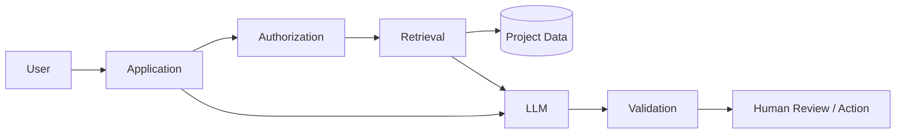

# AI System Design

## Framework
1. define user outcome and failure cost;
2. identify deterministic vs model-suitable work;
3. choose model/capabilities;
4. design context/retrieval;
5. define structured outputs/tools;
6. add validation/human approval;
7. evaluate offline;
8. observe production;
9. manage cost/latency/privacy.

## Example: Project Status Assistant
Inputs: authorized project artifacts, task status, risks and meeting notes. Retrieval selects relevant current evidence. Model produces structured summary, risks and actions. High-impact changes remain human-approved.

## Architecture

