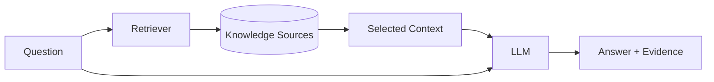

# Retrieval-Augmented Generation (RAG)

RAG retrieves relevant external knowledge and supplies it to a model before generation.

## Why
Improve grounding/freshness and allow answers over private/domain material.

## Failure modes
Wrong retrieval, stale documents, missing context, chunk fragmentation, access-control leakage, conflicting sources and model overclaiming.

## Evaluation
Evaluate retrieval separately from generation. A fluent answer cannot compensate for missing/wrong evidence.
